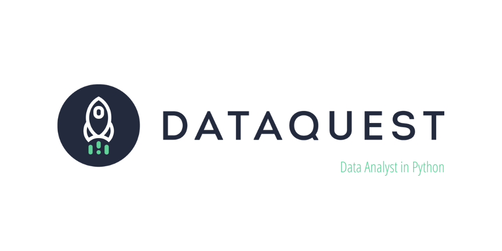

# **Data Analyst in Python - Dataquest**

Esse repositório é destinado à documentar a trilha de estudos de [Beatriz Maia](https://github.com/beatrizmaiads) e [Marina Borges](https://github.com/inaborges) pelos cursos da plataforma do [Dataquest](https://dataquest.io/).  

Bia e Marina são duas amigas que resolveram se juntar para estudar em conjunto e tornar tudo o que envolve o aprendizado ainda mais divertido. Além de claro, aproveitar e exercitar as habilidades de se trabalhar em equipe.

[Neste link](https://app.dataquest.io/path/data-analyst) você encontra o path de Data Analyst do Dataquest.

## **O Path de Data Analyst do Dataquest inclui os seguintes cursos:**

### **[Step 1: Introduction to Python](https://github.com/beatrizmaiads/data-analyst-path/tree/main/step1)**
    - Python for Data Science: Fundamentals
    - Python for Data Science: Intermediate
 
###  **[Step 2: Intermediate Python and Pandas](https://github.com/beatrizmaiads/data-analyst-path/tree/main/step2)**
    - Pandas and NumPy Fundamentals
    - Data Visualization Fundamentals
    - Storytelling Data Visualization and Information Design
    - Data Cleaning and Analysis
    - Data Cleaning in Python: Advanced
    - Data Cleaning Project Walkthrough

### **[Step 3: The Command Line](https://github.com/beatrizmaiads/data-analyst-path/tree/main/step3)**
    - Elements of the Command Line
    - Text Processing in the Command Line

###  **[Step 4: Working with Data Sources](https://github.com/beatrizmaiads/data-analyst-path/tree/main/step4)**
    - SQL Fundamentals
    - APIs and Web Scraping in Python
    - Intermediate SQL for Data Analysis
    - Data Analysis in Business

###  **[Step 5: Probability and Statistics](https://github.com/beatrizmaiads/data-analyst-path/tree/main/step5)**
    - Statistics Fundamentals
    - Statistics Intermediate: Averages and Variability
    - Probability: Fundamentals
    - Conditional Probability
    - Hypothesis Testing: Fundamentals

###  **[Step 6: Advanced Topics in Data Analysis](https://github.com/beatrizmaiads/data-analyst-path/tree/main/step6)**
    - Command Line: Intermediate
    - Git and Version Control

